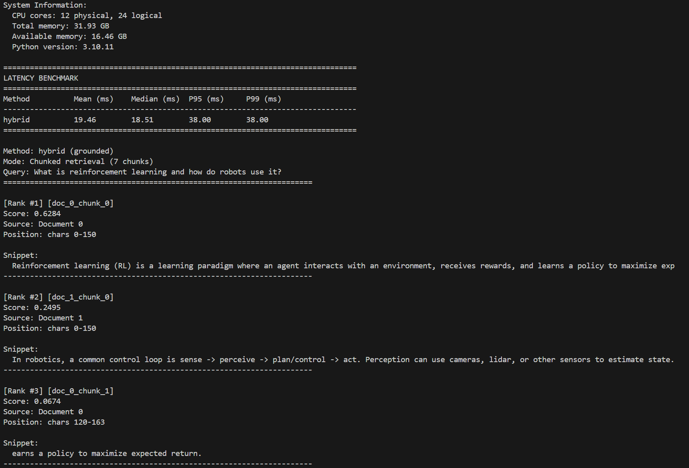

# RAG‑Lite: Retrieval System + Benchmarks (TF‑IDF, BM25, Embeddings, Reranking)

[](https://github.com/OctaviusLeo/rag-lite-tfidf-eval/actions)
[](https://codecov.io/gh/OctaviusLeo/rag-lite-tfidf-eval)
[](https://www.python.org/downloads/)
[](https://github.com/psf/black)
[](https://github.com/astral-sh/ruff)

RAG‑Lite is a compact, production‑style retrieval stack: multiple retrieval methods (TF‑IDF, BM25, dense embeddings), optional cross‑encoder reranking, chunking with stable citations, and an evaluation + benchmarking harness.

This repo is optimized for demonstrating real engineering trade‑offs (quality vs latency vs memory) with reproducible metrics.

## Table of Contents

- [Overview (features & modules)](#core-features)
- [Setup (requirements & installation)](#requirements)
- [Quickstart](#quickstart)
  - [More examples](#basic-usage-tf-idf-only)
    - [Basic usage](#basic-usage-tf-idf-only)
    - [Performance benchmarking](#performance-benchmarking)
    - [Benchmark comparison](#comprehensive-benchmark-comparison)
    - [Chunking with grounding](#chunking-with-citation-grounding)
    - [Hybrid + reranking](#hybrid-retrieval--chunking--reranking-full-pipeline)
    - [Ablation study](#ablation-study-compare-all-methods)
- [Reference: Performance & Evaluation](#performance-analysis)
  - [Performance Analysis](#performance-analysis)
  - [Citation Grounding](#citation-grounding)
  - [Evaluation Framework](#evaluation-framework)
- [Reference: Project Structure](#project-structure)
  - [System Architecture](#system-architecture)
- [Development](#development)
  - [Testing](#testing)
  - [Code Quality](#code-quality)
- [Troubleshooting](#troubleshooting)
  - [CI & Contributing](#continuous-integration)
  - [Technical Notes](#technical-notes)

---

### Demo



---

<details>
<summary><strong>Overview (features & modules)</strong></summary>

---

### Core Features

**Multi-Method Retrieval** ([src/rag.py](src/rag.py))
- TF-IDF baseline implementation
- BM25 (Okapi) statistical ranking
- Dense embeddings using Sentence-BERT (all-MiniLM-L6-v2)
- Hybrid score fusion with configurable weights
- Cross-encoder reranking (ms-marco-MiniLM-L-6-v2)

**Document Chunking and Citation Tracking** ([src/rag.py](src/rag.py))
- Configurable chunk size and overlap parameters
- Stable citation identifiers (`[doc_0_chunk_2]`)
- Character-level position tracking
- Source document attribution
- Automated snippet generation

**Performance Benchmarking** ([src/benchmark.py](src/benchmark.py))
- Latency measurement: mean, median, P95, P99 query times
- Memory profiling: usage tracking and peak consumption
- Throughput calculation: queries per second, passages per second
- Index build time analysis
- System information capture (CPU, memory, Python version)
- Cross-method comparison framework

**Evaluation and Analysis**
- Advanced metrics: MRR@K, nDCG@K, Precision@K, Recall@K ([src/evaluate.py](src/evaluate.py))
- Ablation study framework for method comparison ([src/ablation.py](src/ablation.py))
- Per-query detailed reports with error analysis
- Comprehensive benchmark comparison tool ([src/benchmark_comparison.py](src/benchmark_comparison.py))

**Command-Line Interface**
- Index building with hybrid components ([src/build_index.py](src/build_index.py))
- Query execution with multiple retrieval methods ([src/query.py](src/query.py))
- Grounded retrieval demonstration ([src/demo_grounded.py](src/demo_grounded.py))

</details>

<details>
<summary><strong>Setup (requirements & installation)</strong></summary>

## Requirements
- Python 3.10 or higher
- pip package manager
- Git version control

## Installation

Clone the repository:
```bash
git clone https://github.com/OctaviusLeo/rag-lite-tfidf-eval.git
cd rag-lite-tfidf-eval
```

### Production installation
```bash
pip install .
```

### Development installation (includes testing and linting tools)
```bash
python -m venv .venv
# Windows: .venv\Scripts\activate
# macOS/Linux: source .venv/bin/activate
pip install -e ".[dev]"
```

### Manual dependency installation
```bash
pip install -r requirements.txt
```

</details>

## Quickstart

If you only run one thing, run the TF‑IDF baseline end‑to‑end:

```bash
python src/build_index.py
python src/query.py --q "What is reinforcement learning?" --k 3
python src/evaluate.py --k 3
```

Tip: The package also exposes console scripts (equivalent to the Python commands):

```bash
rag-build
rag-query --q "What is reinforcement learning?" --k 3
rag-eval --k 3
```

<details>
<summary><strong>More examples (benchmarking, chunking, hybrid, ablation)</strong></summary>

### Basic usage (TF-IDF only)
```bash
# Build simple TF-IDF index
python src/build_index.py

# Query
python src/query.py --q "What is reinforcement learning?" --k 3

# Evaluate
python src/evaluate.py --k 3
```

### Performance benchmarking
```bash
# Build index with performance metrics
python src/build_index.py --benchmark --out outputs/index_bench.pkl

# Output:
# Build time: 0.003s
# Memory used: 0.22 MB
# Peak memory: 321.35 MB
# Index size on disk: 0.01 MB
# Indexing throughput: 1668.78 passages/sec

# Query with latency measurement (20 trials by default)
python src/query.py --index outputs/index_bench.pkl --q "What is RL?" --k 3 --benchmark

# Output:
# Method          Mean (ms)    Median (ms)  P95 (ms)     P99 (ms)
# tfidf           0.60         0.00         3.03         3.03

# Evaluate with performance metrics
python src/evaluate.py --index outputs/index_bench.pkl --k 3 --benchmark

# Output:
# Total evaluation time: 0.004s
# Average time per query: 1.35ms
# Per-query latency: Mean: 1.01ms, Median: 1.05ms, P95: 1.65ms
# Memory used: 0.21 MB
```

### Comprehensive benchmark comparison
```bash
# Compare all retrieval methods side-by-side
python src/benchmark_comparison.py --num-trials 10

# Output example:
# Index                     Method               Avg Latency (ms)   P95 (ms)     Size (MB)
# TF-IDF Only               tfidf                0.70               1.63         0.01
# Hybrid                    tfidf                0.74               1.27         174.36
#                           bm25                 0.03               0.33
#                           embeddings           18.68              36.12
#                           hybrid               21.96              41.92
#
# Notes:
# - The script loads whatever indexes exist under outputs/ (outputs/index.pkl,
#   outputs/index_hybrid.pkl, outputs/index_chunked.pkl).
# - If an index does not include embeddings/reranker components, the corresponding
#   methods will be skipped instead of failing.
```

### Chunking with citation grounding
```bash
# Build chunked index (200 char chunks, 50 char overlap)
python src/build_index.py --chunking --chunk-size 200 --overlap 50 --out outputs/index_chunked.pkl

# Query with grounded results (shows citations and snippets)
python src/query.py --index outputs/index_chunked.pkl --q "What is reinforcement learning?" --k 3 --grounded

# Example output:
# [Rank #1] [doc_0_chunk_0]
# Score: 0.4148
# Source: Document 0
# Position: chars 0-163
# Snippet:
#   Reinforcement learning (RL) is a learning paradigm where an agent...
```

### Hybrid retrieval + chunking + reranking (full pipeline)
```bash
# Build hybrid chunked index with all methods
python src/build_index.py --chunking --chunk-size 150 --overlap 30 --bm25 --embeddings --reranker --out outputs/index_chunked_hybrid.pkl --benchmark

# Query with hybrid method and citations
python src/query.py --index outputs/index_chunked_hybrid.pkl --q "robot perception" --k 3 --method hybrid --grounded --benchmark

# Run grounded retrieval demo
python src/demo_grounded.py --index outputs/index_chunked_hybrid.pkl --method hybrid --k 3
```

Note: embedding + reranker builds will download pretrained models on first run and can be memory‑heavy.

### Ablation study (compare all methods)
```bash
# Build a hybrid index (BM25 enabled). Add --embeddings/--reranker if machine supports it.
python src/build_index.py --bm25 --out outputs/index_hybrid.pkl

# Run ablation study
python src/ablation.py --index outputs/index_hybrid.pkl --k 3

# Generates comparison table:
# Method                         Recall@3        MRR@3
# ----------------------------------------------------------------------
# tfidf                          1.0000          1.0000
# bm25                           1.0000          0.8333
# embeddings                     1.0000          1.0000
# hybrid                         1.0000          1.0000
# hybrid + Rerank                1.0000          1.0000
```

</details>

<details>
<summary><strong>Reference: performance, grounding, evaluation outputs</strong></summary>

## Performance Analysis

### Metrics Collected
- **Build time**: Index construction latency
- **Query latency**: Mean, median, P95, P99 across multiple trials
- **Memory**: Peak memory usage during indexing and querying
- **Throughput**: Queries per second, passages per second
- **Index size**: On-disk storage requirements
- **System information**: CPU cores, total memory, Python version

### Performance Characteristics
Speed comparison across retrieval methods:
- BM25: 0.03ms average (fastest)
- TF-IDF: 0.70ms average (baseline)
- Embeddings: 18.68ms average (semantic quality)
- Hybrid: 21.96ms average (best quality)

Memory and storage trade-offs:
- TF-IDF only: 0.01 MB index
- Hybrid: 174.36 MB index (includes embeddings)
- 658x speed difference between fastest and slowest methods
- 21,000x size difference between smallest and largest indices

### Implementation Details

**Document Chunking**
- Configurable chunk size in characters (default: 200)
- Overlap between consecutive chunks (default: 50)
- Sentence boundary detection for natural breaks
- Stable citation identifiers for each chunk
- Source document and position tracking

Example:
```
Original text (300 chars):
"Reinforcement learning is... [150 chars] ...maximize reward. Deep RL combines... [150 chars] ...neural networks."

With chunk_size=150, overlap=30:
- Chunk 0 (chars 0-150): "Reinforcement learning is... maximize reward."
- Chunk 1 (chars 120-270): "reward. Deep RL combines... neural networks."
```

## Citation grounding

### Features
- **Stable IDs**: `[doc_0_chunk_2]` format for permanent reference
- **Character positions**: Track exact location in source
- **Source attribution**: Link back to original document
- **Snippet generation**: Truncated text for display
- **No LLM required**: Demonstrate grounding with retrieval alone

**Retrieval Methods**
- **TF-IDF**: Classic sparse retrieval using term frequency and inverse document frequency
- **BM25**: Probabilistic ranking function (Okapi BM25) with tuned parameters
- **Embeddings**: Dense semantic vectors using Sentence-BERT (all-MiniLM-L6-v2)
- **Hybrid**: Weighted score fusion (default: 40% TF-IDF, 30% BM25, 30% embeddings)
- **Reranking**: Cross-encoder rescoring of top-K candidates for improved precision

## Evaluation Framework

The evaluation harness generates detailed analysis files in the `outputs/` directory:

- **per_query_report.jsonl**: Per-query metrics and rankings
- **worst_20_queries.json**: Error analysis for targeted improvement
- **ablation_results.json**: Method comparison data
- **benchmark_comparison.json**: Performance comparison across methods
- **grounded_demo.txt**: Example grounded retrieval with citations

Example evaluation output:
```
EVALUATION RESULTS @ K=3
Total Queries:     3
Recall@3:         1.0000
MRR@3:            1.0000
nDCG@3:           1.0000
Precision@3:      0.3333

PERFORMANCE METRICS (with --benchmark):
Total evaluation time: 0.004s
Average time per query: 1.35ms
Per-query latency: Mean: 1.01ms, P95: 1.65ms
Memory used: 0.21 MB
```

</details>

<details>
<summary><strong>Reference: project structure & architecture</strong></summary>

## Project Structure
- [src/rag.py](src/rag.py): Core retrieval implementation with multiple methods, chunking, and citation tracking
- [src/benchmark.py](src/benchmark.py): Performance measurement utilities for latency, memory, and throughput
- [src/build_index.py](src/build_index.py): Index building with optional chunking and hybrid components
- [src/query.py](src/query.py): Query interface with method selection and performance measurement
- [src/demo_grounded.py](src/demo_grounded.py): Demonstration of citation-grounded retrieval
- [src/benchmark_comparison.py](src/benchmark_comparison.py): Cross-method performance comparison
- [src/ablation.py](src/ablation.py): Ablation study framework for method analysis
- [src/evaluate.py](src/evaluate.py): Evaluation harness with multiple metrics and benchmarking
- [src/io_utils.py](src/io_utils.py): File I/O utilities
- [data/docs.txt](data/docs.txt): Sample document corpus
- [data/eval.jsonl](data/eval.jsonl): Evaluation dataset
- [requirements.txt](requirements.txt): Python dependencies
- [pyproject.toml](pyproject.toml): Project configuration and build settings

## System Architecture

```
Query Processing Pipeline:
  Query Input
      ↓
  Document Chunking (optional)
      ↓
  Retrieval Methods (TF-IDF, BM25, Embeddings)
      ↓
  Score Fusion (Hybrid)
      ↓
  Cross-Encoder Reranking (optional)
      ↓
  Grounded Results with Citations
      ↓
  Performance Metrics Collection
```

</details>

<details>
<summary><strong>Development</strong></summary>

## Development

### Testing
```bash
# Install development dependencies
pip install -e ".[dev]"

# Run test suite (excludes slow embedding tests)
pytest tests/ -v -m "not slow"

# Run all tests with coverage report
pytest tests/ -v --cov=src --cov-report=html

# Run specific test module
pytest tests/test_retrieval.py -v
```

### Code Quality
```bash
# Format code
black src tests

# Run linter with auto-fix
ruff check src tests --fix

# Optional type checking (not installed by default)
pip install mypy
python -m mypy src
```

</details>

<details>
<summary><strong>Troubleshooting, CI, contributing, notes</strong></summary>

## Troubleshooting

### Embeddings / reranker model downloads

- First run may download pretrained models via `sentence-transformers` / `transformers`.
- If you are on a constrained machine, start with TF‑IDF/BM25 only (omit `--embeddings` and `--reranker`).

### Windows error: paging file too small (OSError 1455)

If you see `OSError: The paging file is too small for this operation to complete (os error 1455)`, it typically means Windows virtual memory is too small for loading the model weights.

- Easiest workaround: run without `--embeddings` / `--reranker`.
- Otherwise: increase Windows virtual memory (paging file), then retry.

### Partial / corrupt index files

If a run is interrupted during a heavy build, you may end up with an unusable index file in `outputs/`.
Delete the affected `outputs/*.pkl` and rebuild.

### Continuous Integration
GitHub Actions workflow includes:
- Code quality checks (Ruff linting, Black formatting)
- Multi-platform testing (Linux, Windows, macOS)
- Multi-version testing (Python 3.10, 3.11, 3.12)
- Coverage reporting (Codecov integration)
- Package build validation

See [.github/workflows/ci.yml](.github/workflows/ci.yml) for the complete CI configuration.

### Contributing
1. Fork the repository
2. Create a feature branch
3. Implement changes with corresponding tests
4. Run tests and linting locally
5. Submit a pull request with a clear description

## Technical Notes
- Index output defaults to `outputs/index.pkl` (configurable with `--out` flag)
- Performance metrics available via `--benchmark` flag
- Hybrid index includes all retrieval methods for ablation studies
- Document chunking is optional (defaults to full passages)
- Chunk overlap preserves context across boundaries
- Citation identifiers remain stable across index rebuilds
- First run downloads pre-trained models (approximately 180MB for embeddings and reranker)
- Embedding-based methods trade latency for semantic quality
- Ablation studies help identify optimal method for specific use cases
- Benchmark comparisons quantify speed, quality, and memory trade-offs

</details>

# Future Plans
- AG-Lite as a real product
