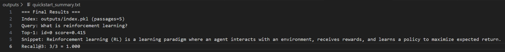

# RAG-Lite — TF-IDF Retrieval + Simple Evaluation
Minimal retrieval baseline: build a TF-IDF index over passages, query it, and score Recall@K on a tiny eval set. No external model APIs required.



Demo: 


## What’s included
- TF-IDF indexing and retrieval ([src/rag.py](src/rag.py))
- CLI to build index ([src/build_index.py](src/build_index.py))
- CLI to query top-k passages ([src/query.py](src/query.py))
- Simple Recall@K evaluation over a JSONL set ([src/evaluate.py](src/evaluate.py))
- Sample data: [data/docs.txt](data/docs.txt), [data/eval.jsonl](data/eval.jsonl)

## Requirements
- Python 3.10+
- pip

## Setup
```bash
python -m venv .venv
# Windows: .venv\Scripts\activate
# macOS/Linux: source .venv/bin/activate
pip install -r requirements.txt
```

## Quickstart
Build index, query, and evaluate:
```bash
# Build index from sample docs
python src/build_index.py

# Query (returns top passages)
python src/query.py --q "What is reinforcement learning?" --k 3

# Run a tiny eval set (Recall@K)
python src/evaluate.py --k 3

# One-shot quickstart (build -> query -> eval -> summary)
python src/run_quickstart.py --k 3 --summary outputs/quickstart_summary.txt
```

## File map
- [src/rag.py](src/rag.py): TF-IDF index and retrieve
- [src/build_index.py](src/build_index.py): build and persist index
- [src/query.py](src/query.py): CLI for queries
- [src/evaluate.py](src/evaluate.py): Recall@K over eval JSONL
- [src/io_utils.py](src/io_utils.py): small file helpers
- [data/docs.txt](data/docs.txt): sample corpus (blank-line separated passages)
- [data/eval.jsonl](data/eval.jsonl): sample eval set with `query` and `relevant_contains`
- [requirements.txt](requirements.txt): numpy, scikit-learn

## Notes
- Index output is written to `outputs/index.pkl` by default.
- Passages are split on blank lines; adjust `split_passages` in [src/rag.py](src/rag.py) if your corpus differs.
- Increase `--k` in query/eval to change the number of retrieved passages.
